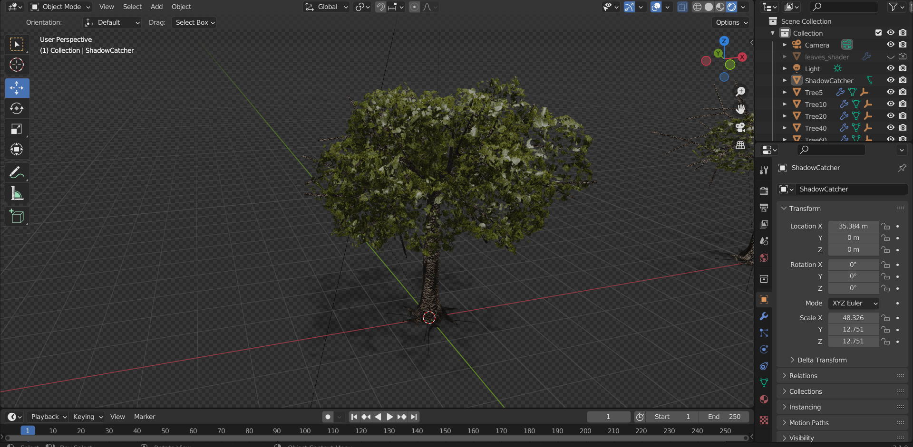

# Åpen-Oppgave-Henrik.F.Wilhelmsen
## Henrik Game engine
The engine i have made is able to create gameobjects and make it choose its rendering method on a canvas
I also have made a resourcelibrary engine, that reads the files in the project and stores the key of directories
going down, this makes it easy to get files like png sprites to my gameobjects.
The animation-manager i have can take in sprites and chose a subimage from the full image to create animation effects
##The game
To be able to do this i have spent countless hours not only programming but also creating the sprites for the game,
i learned blender animations, modeling and shaders so i could make the sprites for the game. The goal of the game is to kill
all the 50 zombies. if you die you can reset, and the same for victory, try to roam the map to find the axe laying on the ground
this will give you additional damage to objects and zombies

###Blender

###Example for the sprites for character

##Controls
* Press 'E' to use action, pick an item from the ground or damage zombies, trees or stones
* Press 'F' to drop the weapon in your hand

* Press 'WASD' to walk around
* Press 'Shift' to run

* press '1' for debug render colliders
* press '2' for debug render objectPoint
* press '3' for debug render lines to rendered objects

##My original plans
I wanted to make a fully modular GameEngine so i could easily duplicate this engine and create a new game
The game I was going to make using this engine was to create an island survival game where you could chop down trees and get
some resources, but in the last minute i added some zombies you need to kill to win.

##What could i have one better
I think i have successfully created something pretty good and i can see myself creating some games using this engine
but i would like change the rendering methods and the amount of for-loops/lambda expressions to iterate
the game objects, the structure could be better and i could have tried to use more try and excepts to catch potential errors.